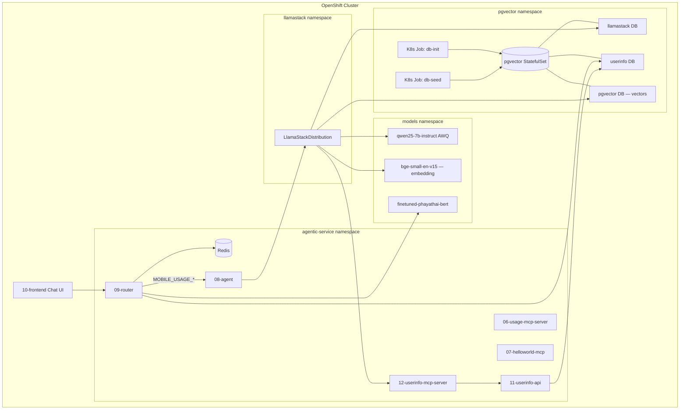

# Architecture

This document describes the end-to-end architecture of the **AI Agentic Use Case** — a mobile-plan advisory system built on Red Hat OpenShift AI.

## High-Level Flow

## Databases

A single **pgvector** PostgreSQL instance hosts three databases:

| Database | Owner Role | Purpose |
|----------|-----------|---------|
| `pgvector` | `appuser` | Vector store for RAG (plan documents). Has `vector` extension. |
| `userinfo` | `user_info` | User profiles, subscriptions, plans, usage records, billing, insights, chat session archive. |
| `llamastack` | `llamastack` | LlamaStack internal state (KV store, SQL store for conversations, inference logs, agent state). |

Database initialization and seeding happen via **Kubernetes Jobs** triggered by `02-pgvector/post-deploy/` scripts.

## Models

Three models must be pre-deployed as **KServe InferenceServices** before running the deployment script. Reference manifests are in `components/03-models/reference/`.

| Model | Used By | Purpose |
|-------|---------|---------|
| `qwen25-7b-instruct` (AWQ) | **LlamaStack** | Decoder LLM for reasoning, tool calling, and plan comparison |
| `finetuned-phayathai-bert` | **Router** | Intent classification — classifies user messages into 10 mobile-service intents |
| `bge-small-en-v15` | **LlamaStack** | Embedding model for semantic search (384-dimensional vectors) |

## LlamaStack

The **LlamaStackDistribution** provides a unified API layer:

- **Inference**: Proxies to Qwen (LLM) and BGE-small (embeddings) via vLLM, plus inline `sentence-transformers` for `all-MiniLM-L6-v2`
- **Vector I/O**: pgvector-backed vector store for mobile plan documents
- **Agents API**: Manages agent sessions with tool calling and RAG
- **Tool Runtime**: MCP (Model Context Protocol) provider connects to external MCP servers
- **Storage**: All state persisted to the `llamastack` database

## Request Flow

1. **User** opens the Streamlit Chat UI and sends a message
2. **Router** (09) receives `POST /chat`:
   - Resolves the user from `userinfo` DB
   - Classifies intent via BERT (or uses `predefined_intent`)
   - For `MOBILE_USAGE_CHECK_DATA_CURRENT` or `MOBILE_USAGE_COMPARE_DATA_PLAN` intents, forwards to the **Agent**
   - Other intents return stub responses
   - Stores session transcript in Redis, archives to Postgres
3. **Agent** (08) receives `/recommend`:
   - Creates a LlamaStack agent session with MCP tools + RAG toolgroups
   - LlamaStack invokes Qwen for reasoning, calls MCP tools as needed
   - For usage checks: calls `userinfo-mcp-server` tools (user data, subscriptions, usage)
   - For plan comparison: also triggers `builtin::rag` knowledge search over mobile plan documents
4. **LlamaStack** orchestrates tool calls → **UserInfo MCP** (12) → **UserInfo API** (11) → **userinfo DB** (02)
5. Response streams back through Agent → Router → UI

## Vector Ingestion and Reranking

- **Embedding model**: `bge-small-en-v15` (384-dimensional) served via vLLM, registered in LlamaStack as `vllm-bge-small/bge-small-en-v15`
- **Initial setup**: Post-deploy scripts create a vector store and ingest plan documents via the LlamaStack `/v1/files` and `/v1/vector_stores` APIs
- **Production**: Vector ingestion at scale uses **Kubeflow Pipelines** in OpenShift AI
- **Reranking**: When the agent handles plan comparison intents, it performs a direct vector search (top-K candidates), sends them to a **Qwen3-Reranker** model for cross-encoder reranking, and injects the top-N most relevant plans into the LLM context. This improves recommendation quality over raw vector similarity alone

## Namespaces

| Namespace | Components |
|-----------|-----------|
| `${NS_PGVECTOR}` (e.g. `pg-vector`) | PostgreSQL + pgvector StatefulSet, init/seed Jobs |
| `${NS_MODELS}` (e.g. `intent-classification-sidd`) | KServe InferenceServices (Qwen, BERT, BGE) |
| `${NS_LLAMASTACK}` (e.g. `llamastack`) | LlamaStackDistribution |
| `${NS_SERVICES}` (e.g. `agentic-service`) | Redis, Router, Agent, MCP servers, UserInfo API/MCP |
| `redhat-ods-applications` | RHOAI dashboard, GenAI Studio config |

## GenAI Studio Integration

MCP servers are registered in the `gen-ai-aa-mcp-servers` ConfigMap in `redhat-ods-applications`, allowing GenAI Studio to discover and interact with:
- **Usage-MCP-Server** — direct mobile usage queries
- **HelloWorld-MCP-Server** — demo/testing
- **UserInfo-MCP-Server** — full user information queries
